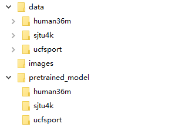
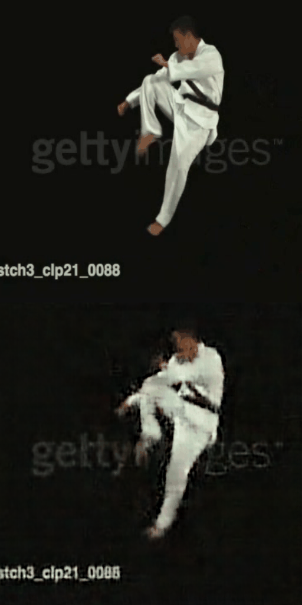

# STRPM (CVPR2022)

Zheng Chang,
Xinfeng Zhang,
Shanshe Wang,
Siwei Ma,
Wen Gao.

Official PyTorch Code for **"STRPM: A Spatiotemporal Residual Predictive Model for High-Resolution Video Prediction"** [[paper]](https://arxiv.org/pdf/2203.16084.pdf)

### Requirements
- PyTorch 1.7
- CUDA 11.0
- CuDNN 8.0.5
- python 3.6.7

### Installation
Create conda environment:
```bash
    $ conda create -n STRPM python=3.6.7
    $ conda activate STRPM
    $ pip install -r requirements.txt
    $ conda install pytorch==1.7 torchvision cudatoolkit=11.0 -c pytorch
```
Download repository:
```bash
    $ git clone git@github.com:ZhengChang467/STRPM.git
```

### Test

For quick start, the [pretrained models](https://drive.google.com/file/d/15D7sHmhBHpqX7nNiJ8p1hzowS0RQqtvp/view?usp=sharing) and the [example data](https://drive.google.com/file/d/1iairxo8iCMO__-_yupwgXbdTAMbdk45l/view?usp=sharing) are needed to be downloaded to the following folders, 



To test our model on the UCF Sport dataset, run the code in the PowerShell using:

```bash
    $ python STRPM_run.py --dataset ucfsport
```

The predictions from the UCF Sport dataset are shown as follows (ground truth (top) and predictions (bottom))



To test our model on the Human3.6M dataset, run the code in the PowerShell using:

```bash
    $ python STRPM_run.py --dataset human36m
```

To test our model on the SJTU4K dataset, run the code in the terminal using:

```bash
    $ python STRPM_run.py --dataset sjtu4k
```

The predicted results will be saved into path results/.
### Train
We plan to share the train codes soon!
### Citation
Please cite the following paper if you feel this repository useful.
```bibtex
@article{chang2022strpm,
title={STRPM: A Spatiotemporal Residual Predictive Model for High-Resolution Video Prediction},
author={Chang, Zheng and Zhang, Xinfeng and Wang, Shanshe and Ma, Siwei and Gao, Wen},
journal={arXiv preprint arXiv:2203.16084},
year={2022}
}
```
### License
See [MIT License](https://github.com/ZhengChang467/STRPM/blob/master/LICENSE)

